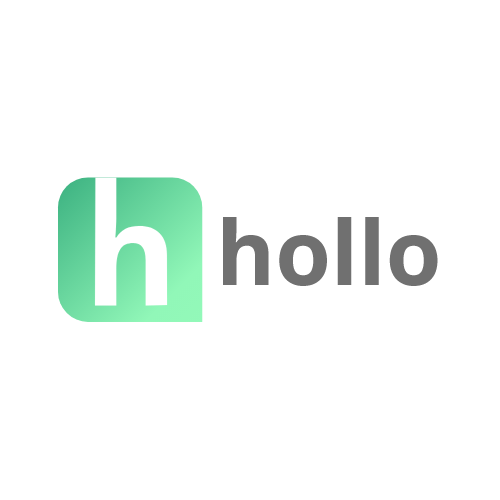
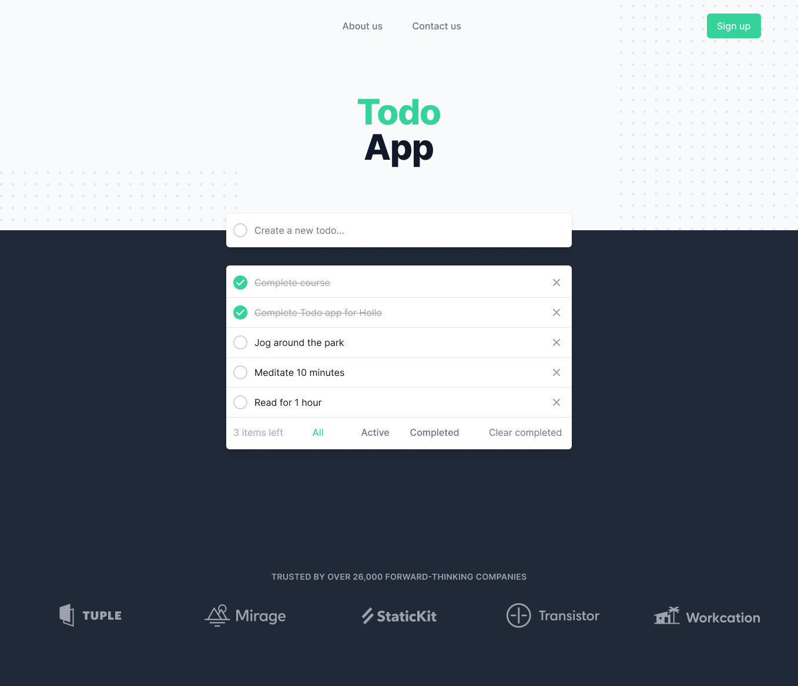
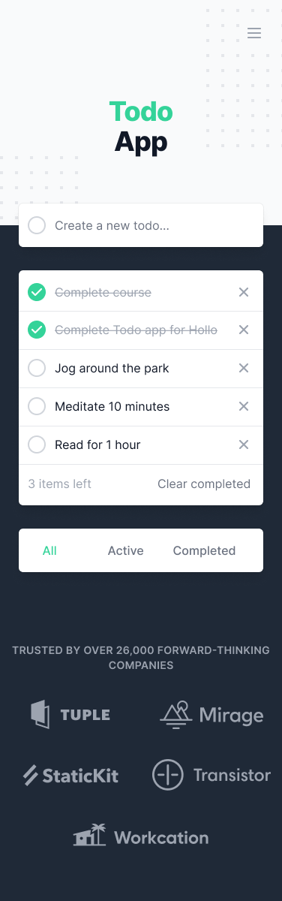
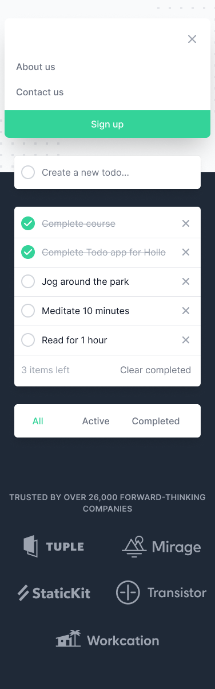

    

Hollo is a health-tech social enterprise with unique research-backed Behavioral Health AI models. Our mission is to increase accessibility for patients, providers and organizations through technology - democratizing AI in mental health. By utilizing AI to predict and screen for the clients' mental health status with live data, it can streamline diagnostics and curate Prescription Digital Therapeutics - ultimately improving patient outcome. By improving current practices, Hollo empowers clinicians to improve their accuracy and regularity of tracking patients; be alerted when the models predict deteriorating symptoms; and improve compliance and transparency in digital health.

## About the challenge

This is a basic test, in which you should be able to write a React app, using the provided screens as reference. You'll need to create a responsive Todo app with basic filtering functionality.

Although this is a basic exercise, we’ll be looking for simple, well-designed and tested code in the submission. The expected time spent on this task is 2-4 hours, spending more time is your choice.

## Task

Using the provided screens as a reference, you’ll need to build a set of React components to render the app.

We require the Todo app to be functional using a global state management solution to store the Todos. So this stored data will be used when you build the app and the components.

Use the data to display the Todos in a way that matches the given design. The filters are self-explanatory and are expected to be fully functional.

All styles unrelated to the Todo app are considered nice-to-have, but the app is expected to be accessible.

Please include a README with setup instructions, and any tests or other documentation you created as part of your solution.

We also recommend you to use [create-react-app](https://github.com/facebook/create-react-app) in order not to make basic configuration yourself. _Note that extra points will be given for using Next.js instead._

You can use any frameworks or packages as long as you can explain to us why you chose them.

 

## Design

  
   
  
  
 

 

We've provided [designs](https://www.figma.com/file/YOD1Oh3YYO6nzi2NRW5VXz/Frontend-Challenge) for both desktop and mobile versions. You should follow design measurements in the Figma file. _In case you use TailwindCSS, you may use the built-in systems._

There are also screens designed for mobile. Including a fully accessible modal for the mobile menu, as per the design, is a big plus.

We encourage you to use latest CSS techniques(like flex-box) and a responsive design approach.

 

## Details

#### Home Page

The main functionality of this page is that it accepts user input to create a Todo.

The user is expected to write a Todo in the given space, the input field with the placeholder "Create a new todo...". The user is allowed to type a multiline input for the task.

The box containing the Todo list is allowed to grow indefinitely if the user keeps creating new todos.

Near the bottom of the page, there are additional functionalities for the user. There is a number that reflects how many active tasks are remaining, which is expected to change according to the user's actions. The user is also allowed to bulk delete tasks as long as they're completed by clicking on the "Clear Completed" button.

There are 3 options allowed for filtering Todos on the app:

- "All"
- "Active"
- "Completed"

You may need to account for any loading and error states. Any buttons or clickable elements are also expected to have hover states and also be accessible.

Please create components for each part of the page (eg. header, content, footer, etc).

You can assume that you do not have to support legacy browsers without features such as fetch or flexbox.

#### Other Pages (e.g. About us)

Any other pages as stated in the navigation bar are just there for aesthetic reasons and can be a dummy page. Please implement the routing logic such that clicking on the button actually navigates to the dummy page.

#### Colors and typography

Refer to Figma for this information.

 
 

## Nice to have

These are not obligatory but big plus if you implement. Here's few suggestion of things we'd like to see:

- Implement solution in TypeScript.

- Implement solution in Next.js.

- Accessible markup and styling.

- Matching the designs almost perfectly. (Pixel perfect is not required)

- Showing your work through your Git commit history.

- Production grade code (clean, maintainable, reusable code)

- Implement unit tests with Jest & Enzyme or react-rest-renderer.

- Prefer to use a CSS framework, like TailwindCSS.
   

## Submission Guidelines

- Please submit your code by sending a Github repository link.
   

## Project evaluation table

We are evaluating project according to the features which specified table at the below.

First of all, candidates project should have all requirements at base table.
 

| Base requirements                 | Point     |
| --------------------------------- | --------- |
| HTML Markup                       | 10 Points |
| React & State Management          | 20 Points |
| Production grade & Best practices | 15 Points |
| Project folder structure          | 5 Points  |

 

You will get extra points if have implement bonus features.
 

| Bonus              | Point     |
| ------------------ | --------- |
| Typescript         | 15 Points |
| Next.js            | 5 Points  |
| Git commit history | 10 Points |
| Unit Tests         | 10 Points |
| Accessibility      | 10 Points |
